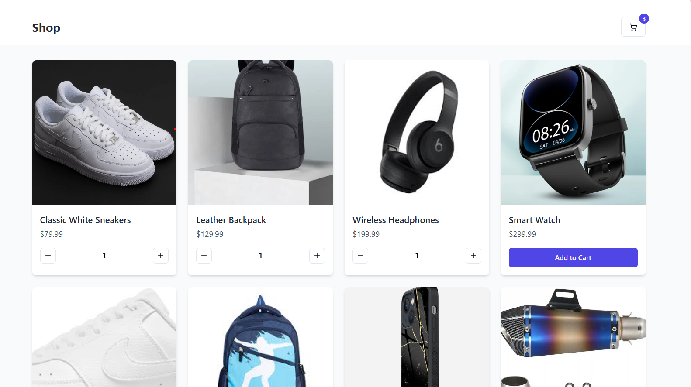
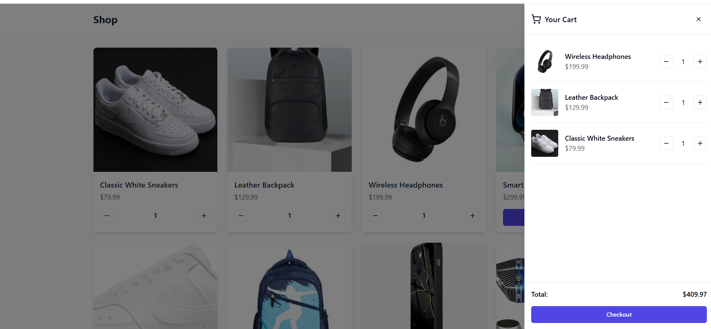
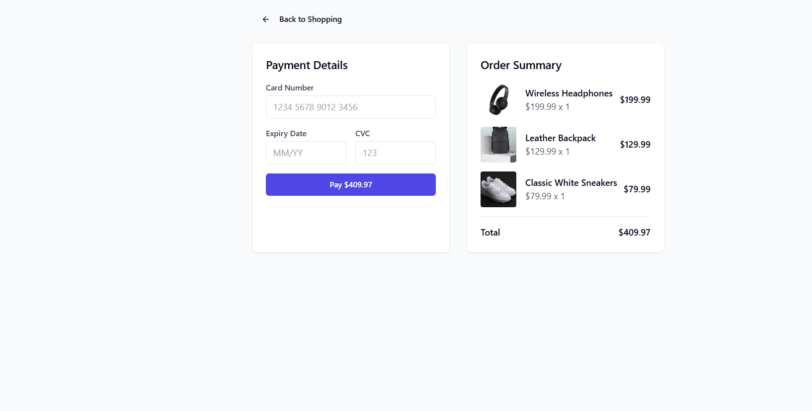

# Shop Cart

A modern e-commerce shopping cart application built with React, TypeScript, and Tailwind CSS.
🌐 [Live Demo](https://shop-cart-gamma.vercel.app/) | [Repository](https://github.com/Vija047/shop-cart)
## Features

-  Product listing with images and details
-  Shopping cart functionality
-  Payment processing interface
-  Light/Dark theme support
-  Responsive design
-Modern UI with Tailwind CSS and shadcn/ui components

## Tech Stack

- [React](https://reactjs.org/)
- [TypeScript](https://www.typescriptlang.org/)
- [Tailwind CSS](https://tailwindcss.com/)
- [shadcn/ui](https://ui.shadcn.com/)
- [Vite](https://vitejs.dev/)
- [React Router](https://reactrouter.com/)
- [React Hook Form](https://react-hook-form.com/)

## Getting Started

### Prerequisites

- Node.js (v18 or higher)
- npm or bun

### Installation

1. Clone the repository:
```bash
git clone <repository-url>
cd shopcart
```

### Project Structure

```markdown
shopcart/
├── public/
├── src/
│   ├── components/
│   │   ├── ui/          # Reusable UI components
│   │   ├── Cart.tsx     # Shopping cart component
│   │   └── ProductCard.tsx
│   ├── hooks/           # Custom React hooks
│   ├── lib/             # Utility functions
│   ├── pages/           # Route components
│   ├── App.tsx
│   └── main.tsx
├── index.html
└── package.json
```


